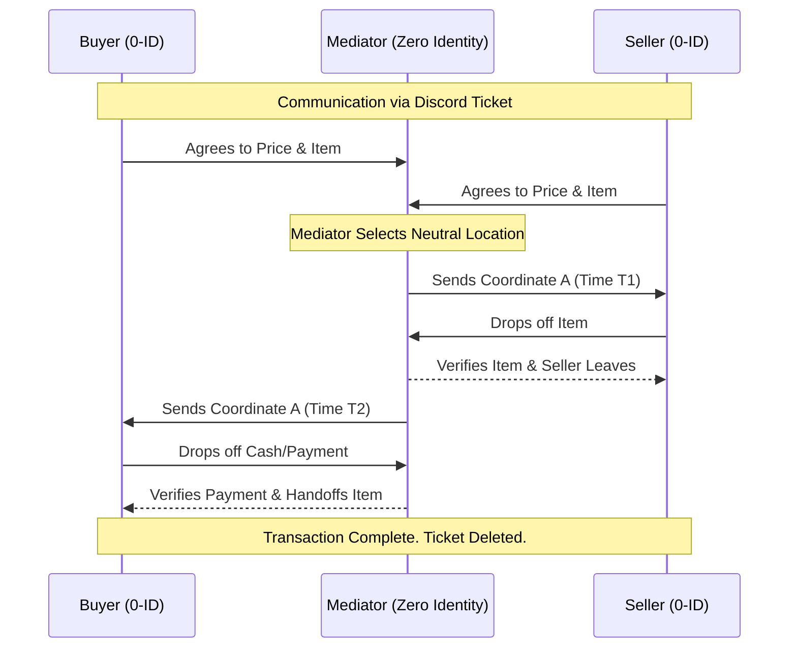

# Zero Identity (0-ID)

<div align="center">
  <h3>The Invisible Bridge. Total Anonymity. Absolute Trust.</h3>
  <p>
    Zero Identity acts as the invisible bridge for anonymous physical transactions. We facilitate blind peer-to-peer exchanges via Discord, ensuring Buyer and Seller never meet. The mediator handles goods and funds verification at a neutral drop point.
  </p>
  <p>
    <a href="#-how-it-works">Workflow</a> •
    <a href="#-funds-verification-protocol">Funds Verification</a> •
    <a href="#-discord-integration">Discord</a> •
    <a href="#-terms-of-service-tos">ToS</a>
  </p>
</div>
---

## 👁️ About Zero Identity

**Zero Identity** acts as a blind proxy for high-stakes or privacy-focused buy/sell transactions. We bridge the gap between a Buyer and a Seller who wish to remain completely anonymous to one another.

* **The Buyer** never learns the identity or appearance of the Seller.
* **The Seller** never learns the identity or appearance of the Buyer.
* **The Transaction** occurs physically at a neutral location designated by the Mediator.

We operate exclusively via **Discord**, utilizing ephemeral ticket systems to coordinate logistics without retaining user data.

## ⚙️ How It Works

We utilize a "Double-Blind Drop" system. The Mediator is the only entity that interacts with both parties.

## The Workflow
1. Ticket Creation A user opens a "Transaction Ticket" on the Zero Identity Discord.

2. The Agreement The Buyer and Seller are added to separate, private channels within the ticket. They never speak directly. The Mediator relays the price, item condition, and terms.

3. The Verification

Seller: Submits proof of ownership (timestamped photo).

Buyer: Submits proof of funds.

4. The Exchange (The "Drop") The Mediator designates a secure public location.

Phase 1: Seller meets Mediator, hands over goods, and leaves.

Phase 2: Mediator validates goods against description.

Phase 3: Buyer meets Mediator, hands over funds, receives goods.

Phase 4: Mediator transfers funds to Seller (via Crypto or Cash Drop depending on arrangement).

## 💵 Funds Verification Protocol
To ensure the integrity of the transaction during Phase 3, the Mediator enforces the following:

On-Site Authentication: All cash is counted and scanned (UV/Pen test) in front of the Buyer before the item is released.

Insufficient Funds: If the cash provided is less than the agreed price, the Buyer has 5 minutes to produce the difference. If they cannot, the transaction is voided.

Counterfeit Detection: If fake currency is detected, the transaction is immediately terminated. The item is retained by the Mediator to be returned to the Seller.



## 💻 Commands

Use the following slash commands within the Discord server to interact with the bot:

```bash
/initiate       # Opens a new mediation request ticket
/escrow-status  # Checks the current status of funds and goods
/emergency      # Sends an immediate alert to the Mediator
/help           # Displays the full list of available commands

```


## 🛡️ Security & Privacy
No Logs Policy: Once a transaction ticket is closed, all chat history is purged from our end.

Discord Only: No phone numbers, emails, or real names are ever requested.

Physical Buffer: The Buyer and Seller are never at the same place at the same time. Zero Identity absorbs the risk of physical interaction.

*Note: The item is NEVER handed to the Buyer until the full agreed amount is verified genuine and complete.*

## 💰 Fees
```bash
| Service Type | Rate | Notes |
| :--- | :---: | :--- |
| **Standard Service** | 5% | Calculated on total transaction value. |
| **Priority Drop** | 10% | Rush service for immediate drops. |
| **Minimum Fee** | $50 | Flat fee for small items. |
```

## ⚠️ Terms of Service (ToS)
By using Zero Identity, you agree to the following strict guidelines. Violation results in an immediate ban and blacklist.

1. Prohibited Items
Zero Identity acts as a privacy shield, not a shield for crime. We DO NOT mediate transactions involving:

Narcotics or controlled substances.

Firearms, explosives, or ammunition.

Stolen property.

Human trafficking or exploitation materials.

Any item deemed illegal in the local jurisdiction of the physical drop.

2. Liability
Zero Identity is a mediation service. While we verify items to the best of our ability during the physical handover, we are not responsible for latent defects discovered after the transaction is closed.

3. The "No-Show" Policy
If a party fails to appear at the promised location within 15 minutes:

Seller No-Show: Deal cancelled.

Buyer No-Show: Deal cancelled, item returned to Seller. A penalty fee may apply for future services.


